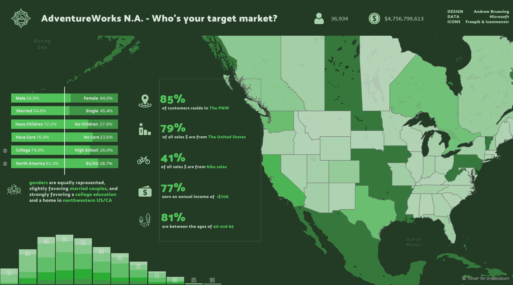

# AdventureWorks-Demographic-Analysis

### Hey! I'm Andrew. Welcome to my [Github] 👋

- 📊 Data visualization is my forte. See my [Tableau] page! 
- 🚀 Most of what you see here is Tableau, Python, and Figma
- 🧠 I'm interested in how our social climate and media trends influence marketing needs
- ⛳ A nice quote: "If it's worth doing, it's worth doing well"

## Wide World Importers
**WWI is a wholesale novelty goods importer and distributor operating from the San Francisco bay area**
 

 Here's a link to the SQL [database] from Microsoft

This readme includes various screenshots, but you can view the actual dashboard [here]

## Approach
1. The pyodbc package was used to connect to the WWI database and query via python. 
2. First, SQL was used to create the **'productdf'** dataframe which detailed qualitative and quantitative data at the granularity level of Stock Item ID. We'd like to see a breakdown of sales success per category>subcategory>product>size/color.
3. Next, SQL was then used to create **'timedf'** which will compare transformations of revenue and profit over time.
4. Regex was implemented to standardize StockItemName in **'productdf'**, and to categorize it in **'timedf'**.
5. And finally, the two dataframes were exported from Python and imported to Tableau. 
6. The complete dashboard features hover tooltips on most graphics and text boxes.
 

## Data Insights
- **New products; new priorities:** 
    In 2016, we added 8 new products in a brand new Candy category. We may need to reconsider how we chose to allocate our resources. It's likely that our ad spend, human resources, and social media efforts were redistributed to promote this new array of products. As proven by our steep decline, our current arrangement is unsustainable. *(see Line Graph)*

    Is the new Candy category spreading our resources too thin?

    Profit per product can be seen in this box plot to evaluate the efficacy of the Candy category as a whole. A higher concentration of points near the LQ is not a great indication for the success of these products, but more data points would be necessary to reach a more accurate conclusion. *(see **i bubble** on Dashboard Home Sidebar)*
     

- **Q3 is Crucial:**
    One key point to note about our metrics is that they've been calculated based only on the first two quarters of 2016, but all four quarters of previous years. This only partially excuses our sales sums. We are still seeing downward trends in all product categories - the steepest we've seen thus far.

    Identifying problem areas such as our dismal unit margin or a lack of resources in other key departments is pivotal for 3rd and 4th quarter improvement. *(see **i bubble** on Line Graph Sidebar)*
     

- **Our contribution margins aren't contributing enough:**
    The standard markup for individual retail products is 50%. In previous years, we've exceeded that number at an average margin of 54%. In 2016, we averaged a troublesome 25%. 

    One identifiable weak point is our USB category. *(see **i bubble** on Scatter Plot Sidebar)*
    
    This raises a few questions: 
	- What was the logic behind the price point of USB products? 
	- Were they part of a promotion?
	- Was this part of a loss leader strategy?
     

## See the complete interactive dashboard [here]

[Tableau]: https://public.tableau.com/app/profile/andrew.bruening
[Github]: https://github.com/andrewbruening
[here]: https://public.tableau.com/views/AdventureWorks2019/NADB?:language=en-US&:display_count=n&:origin=viz_share_link
[database]: https://docs.microsoft.com/en-us/sql/samples/adventureworks-install-configure?view=sql-server-ver15&tabs=ssms
